# Data Dictionary & Entity Relationship Diagram (ERD)

## 1. Entity Relationship Diagram

```mermaid
erDiagram
    COMPANY ||--o{ JOB_APPLICATION : "has many"
    COMPANY ||--o{ CONTACT : "employs"
    CONTACT ||--o{ JOB_APPLICATION : "primary contact for"
    JOB_APPLICATION ||--o{ INTERVIEW_ROUND : "has many"

    COMPANY {
        int id PK
        string name
        string website
        string logo_path
        string industry
        string location
        text notes
        datetime created_at
        datetime updated_at
    }

    CONTACT {
        int id PK
        int company_id FK
        string full_name
        string role_title
        string email
        string phone
        string linkedin_url
        text notes
        datetime created_at
        datetime updated_at
    }

    JOB_APPLICATION {
        int id PK
        int company_id FK
        int contact_id FK
        string job_title
        string job_url
        text description
        string employment_type
        string location_type
        string location
        decimal salary_min
        decimal salary_max
        decimal salary_offered
        string currency
        string salary_period
        string status
        int priority_rating
        date applied_date
        date deadline_date
        date decision_date
        text notes
        datetime created_at
        datetime updated_at
    }

    INTERVIEW_ROUND {
        int id PK
        int job_application_id FK
        string round_type
        datetime scheduled_at
        int duration_minutes
        string meeting_url
        string location
        string interviewer_name
        string interviewer_title
        string interviewer_email
        string interviewer_linkedin
        text prep_notes
        text questions_asked
        text takeaways
        int rating
        string status
        datetime created_at
        datetime updated_at
    }
```

---

## 2. Table Specifications

### 2.1 `companies`
Stores company profiles that job applications belong to.

| Column | Type | Nullable | Default | Description |
| :--- | :--- | :--- | :--- | :--- |
| `id` | `INTEGER` | No | Auto Increment | Primary Key |
| `name` | `VARCHAR(255)` | No | - | Company Name |
| `website` | `VARCHAR(255)` | Yes | `NULL` | Official Website URL |
| `logo_path` | `VARCHAR(255)` | Yes | `NULL` | Path to uploaded logo file |
| `industry` | `VARCHAR(255)` | Yes | `NULL` | Industry / Sector (e.g. Fintech, SaaS, Healthtech) |
| `location` | `VARCHAR(255)` | Yes | `NULL` | Company Headquarters location |
| `notes` | `TEXT` | Yes | `NULL` | Glassdoor notes, company culture, research |
| `created_at` | `TIMESTAMP` | Yes | `NULL` | Laravel timestamp |
| `updated_at` | `TIMESTAMP` | Yes | `NULL` | Laravel timestamp |

---

### 2.2 `contacts`
Stores recruiters, hiring managers, and referral contacts.

| Column | Type | Nullable | Default | Description |
| :--- | :--- | :--- | :--- | :--- |
| `id` | `INTEGER` | No | Auto Increment | Primary Key |
| `company_id` | `INTEGER` | Yes | `NULL` | Foreign key referencing `companies.id` |
| `full_name` | `VARCHAR(255)` | No | - | Contact Full Name |
| `role_title` | `VARCHAR(255)` | Yes | `NULL` | Title (e.g. Technical Recruiter, Engineering Manager) |
| `email` | `VARCHAR(255)` | Yes | `NULL` | Email Address |
| `phone` | `VARCHAR(255)` | Yes | `NULL` | Phone / Mobile Number |
| `linkedin_url` | `VARCHAR(255)` | Yes | `NULL` | LinkedIn Profile URL |
| `notes` | `TEXT` | Yes | `NULL` | Relationship notes, communication history |
| `created_at` | `TIMESTAMP` | Yes | `NULL` | Laravel timestamp |
| `updated_at` | `TIMESTAMP` | Yes | `NULL` | Laravel timestamp |

---

### 2.3 `job_applications`
The central entity representing a job opportunity applied to or tracked.

| Column | Type | Nullable | Default | Description |
| :--- | :--- | :--- | :--- | :--- |
| `id` | `INTEGER` | No | Auto Increment | Primary Key |
| `company_id` | `INTEGER` | No | - | Foreign key referencing `companies.id` |
| `contact_id` | `INTEGER` | Yes | `NULL` | Primary recruiter/referral (`contacts.id`) |
| `job_title` | `VARCHAR(255)` | No | - | Role title (e.g. Senior Laravel Engineer) |
| `job_url` | `VARCHAR(255)` | Yes | `NULL` | Job posting / Listing URL |
| `description` | `LONGTEXT` | Yes | `NULL` | Job description text / requirements |
| `employment_type` | `VARCHAR(50)` | No | `'full_time'` | `full_time`, `part_time`, `contract`, `internship` |
| `location_type` | `VARCHAR(50)` | No | `'remote'` | `remote`, `hybrid`, `onsite` |
| `location` | `VARCHAR(255)` | Yes | `NULL` | City / Country (e.g. Manila, Remote US) |
| `salary_min` | `DECIMAL(12,2)`| Yes | `NULL` | Minimum salary range |
| `salary_max` | `DECIMAL(12,2)`| Yes | `NULL` | Maximum salary range |
| `salary_offered` | `DECIMAL(12,2)`| Yes | `NULL` | Actual offered salary |
| `currency` | `VARCHAR(10)` | No | `'USD'` | Currency code (USD, PHP, EUR, etc.) |
| `salary_period` | `VARCHAR(20)` | No | `'yearly'` | `yearly`, `monthly`, `hourly` |
| `status` | `VARCHAR(50)` | No | `'applied'` | Current stage (see [[03-Pipeline-Lifecycle]]) |
| `priority_rating`| `INTEGER` | No | `3` | Excitement / Priority score (1 to 5) |
| `applied_date` | `DATE` | Yes | `NULL` | Date application was submitted |
| `deadline_date` | `DATE` | Yes | `NULL` | Application deadline or response deadline |
| `decision_date` | `DATE` | Yes | `NULL` | Date offer was received or rejected |
| `notes` | `LONGTEXT` | Yes | `NULL` | General application notes & thoughts |
| `created_at` | `TIMESTAMP` | Yes | `NULL` | Laravel timestamp |
| `updated_at` | `TIMESTAMP` | Yes | `NULL` | Laravel timestamp |

---

### 2.4 `interview_rounds`
Stores individual interview rounds and logs for a job application.

| Column | Type | Nullable | Default | Description |
| :--- | :--- | :--- | :--- | :--- |
| `id` | `INTEGER` | No | Auto Increment | Primary Key |
| `job_application_id` | `INTEGER` | No | - | Foreign key referencing `job_applications.id` |
| `round_type` | `VARCHAR(50)` | No | `'screening'` | `screening`, `technical`, `system_design`, `behavioral`, `take_home`, `final` |
| `scheduled_at` | `DATETIME` | Yes | `NULL` | Interview scheduled date and time |
| `duration_minutes`| `INTEGER` | Yes | `45` | Expected interview duration in minutes |
| `meeting_url` | `VARCHAR(255)` | Yes | `NULL` | Zoom / Google Meet / Teams link |
| `location` | `VARCHAR(255)` | Yes | `NULL` | Physical room / office location (if on-site) |
| `interviewer_name`| `VARCHAR(255)` | Yes | `NULL` | Name of the interviewer(s) |
| `interviewer_title`| `VARCHAR(255)`| Yes | `NULL` | Interviewer title / position |
| `interviewer_email`| `VARCHAR(255)`| Yes | `NULL` | Interviewer email |
| `interviewer_linkedin`| `VARCHAR(255)`| Yes | `NULL`| Interviewer LinkedIn URL |
| `prep_notes` | `LONGTEXT` | Yes | `NULL` | Study notes, company research, talking points |
| `questions_asked`| `LONGTEXT` | Yes | `NULL` | Technical/behavioral questions asked during round |
| `takeaways` | `LONGTEXT` | Yes | `NULL` | Post-interview reflections, feedback, self-eval |
| `rating` | `INTEGER` | Yes | `NULL` | Performance self-assessment rating (1-5) |
| `status` | `VARCHAR(50)` | No | `'scheduled'` | `scheduled`, `completed`, `passed`, `failed`, `cancelled` |
| `created_at` | `TIMESTAMP` | Yes | `NULL` | Laravel timestamp |
| `updated_at` | `TIMESTAMP` | Yes | `NULL` | Laravel timestamp |
