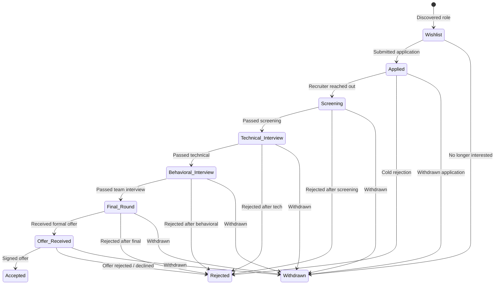

# Application Pipeline & Lifecycle

## 1. Pipeline Stages
The application tracks a candidate's journey through structured, sequential stages:

---

## 2. Stage Breakdown & Definitions

| Stage Key | Display Label | Badge Color | Description |
| :--- | :--- | :--- | :--- |
| `wishlist` | **Wishlist / Saved** | `gray` | Saved job opportunity to apply for later |
| `applied` | **Applied** | `info` (Blue) | Application officially submitted; awaiting reply |
| `screening` | **Screening** | `warning` (Amber) | Recruiter phone screen or initial HR assessment |
| `technical_interview` | **Technical Interview** | `purple` | Live coding, system design, or technical take-home |
| `behavioral_interview`| **Behavioral / Manager** | `cyan` | Culture fit, team fit, or engineering manager interview |
| `final_round` | **Final Round** | `orange` | Executive / Director / VP final interview |
| `offer_received` | **Offer Received** | `success` (Emerald) | Formal compensation offer received |
| `accepted` | **Accepted** | `success` (Green) | Offer accepted and contract signed |
| `rejected` | **Rejected** | `danger` (Red) | Application not selected by company |
| `withdrawn` | **Withdrawn** | `gray` | Candidate voluntarily withdrew application |

---

## 3. Interview Rounds Tracking
Within each application in an active interview stage (`screening`, `technical_interview`, `behavioral_interview`, `final_round`), one or more **Interview Rounds** can be created:
- **Round Types**:
  - `screening`: Initial phone / HR screening
  - `technical`: Coding, algorithm, or pair-programming
  - `system_design`: High-level architecture and system design
  - `behavioral`: Star method, leadership, communication
  - `take_home`: Project assignment / evaluation
  - `final`: Executive / Offer discussion
- **Round Statuses**:
  - `scheduled`: Upcoming interview with date & meeting URL
  - `completed`: Interview took place; notes recorded
  - `passed`: Successful round; moving to next round
  - `failed`: Did not pass round
  - `cancelled`: Rescheduled or cancelled
