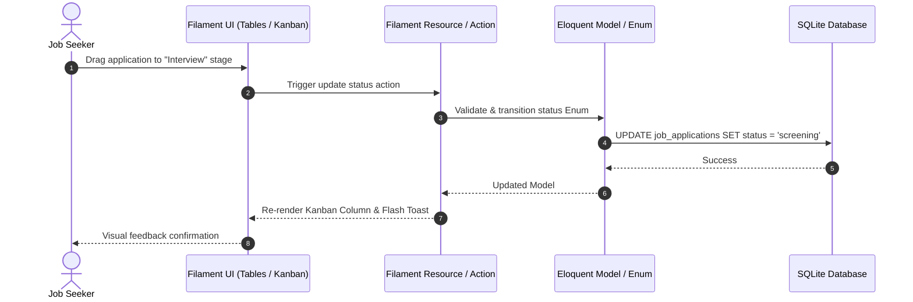

# System Architecture & Technical Design

## 1. Architectural Overview

The application follows a modular, layered MVC architecture built on top of Laravel 12 and Filament:

```
┌────────────────────────────────────────────────────────┐
│                   Presentation Layer                   │
│   Filament Admin Panel (Pages, Tables, Forms, Widgets)  │
│   Livewire Dynamic Components & Kanban Views           │
└───────────────────────────┬────────────────────────────┘
                            │
┌───────────────────────────▼────────────────────────────┐
│                    Application Layer                   │
│   Filament Resources, Actions, Relation Managers       │
│   Form Validation & Request Handling                   │
└───────────────────────────┬────────────────────────────┘
                            │
┌───────────────────────────▼────────────────────────────┐
│                     Domain Layer                       │
│   Eloquent Models, Enums (Status/Types), Scopes        │
│   Model Observers & Business Rules                     │
└───────────────────────────┬────────────────────────────┘
                            │
┌───────────────────────────▼────────────────────────────┐
│                 Persistence & Storage Layer            │
│   SQLite Database (`database.sqlite`)                  │
│   File Storage (Uploaded Resumes, Company Logos)       │
└────────────────────────────────────────────────────────┘
```

---

## 2. Layer Responsibilities

### 2.1 Presentation & Filament Layer
- **Filament Resources**: Provides standard CRUD operations, customized forms with grouped sections/tabs, searchable and filterable tables.
- **Kanban Board**: Livewire-powered interactive board providing visual drag-and-drop status pipeline transitions.
- **Dashboard Widgets**: Real-time stats cards, upcoming interview schedules, and Chart.js analytics.

### 2.2 Domain & Business Logic Layer
- **Backed Enums**: Standardizes constants across the application (`ApplicationStatus`, `EmploymentType`, `LocationType`, `SalaryPeriod`, `RoundType`, `RoundStatus`).
- **Eloquent Relationships**: Enforces referential integrity and eager loading optimizations between `Company`, `Contact`, `JobApplication`, and `InterviewRound`.
- **Query Scopes**: Encapsulates reusable filtering logic (`activeInterviews()`, `pendingOffers()`, `recentApplications()`).

### 2.3 Persistence & Infrastructure Layer
- **Database**: SQLite for lightweight, zero-configuration local storage and fast in-memory CI testing.
- **File System**: Laravel `storage/app/public` disk for file uploads (company logos, CV/resume files).
- **CI / CD Pipeline**: GitHub Actions for automated linting (`Pint`) and test execution (`PHPUnit`).

---

## 3. Data Flow Diagram


